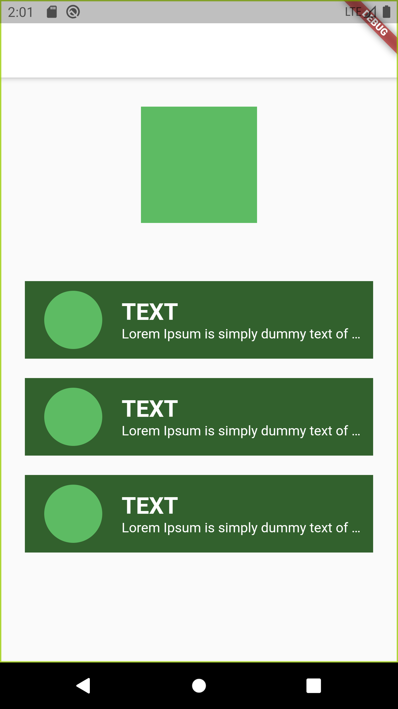

# FirstScreen Flutter

A Mobile Flutter Project To Start to learn Flutter concepts only reading documentation

## Figma Layout

https://www.figma.com/file/6HSRVRnPCUR7RL3mXUiFWb/First-Cellphone-Template?node-id=1%3A10

## Branches
<ul>
    <li>
        <h3>Main</h3>
        
Full Project in one File

    </li>
    <li>
        <h3>separate-to-components</h3>
        
Full Project Separated in Components | Widgets

    </li>
</ul>